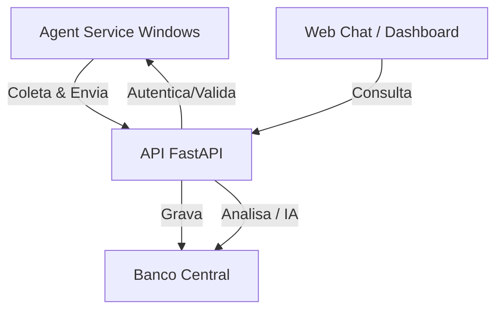

# Arquitetura do projeto SafeBase AI

## Objetivo

Criar um sistema distribuído para análise inteligente dos dados coletados pelo SafeBase. O sistema deverá suportar múltiplas instâncias do SafeBase/serviço local e consolidar essas coletas em uma API central, onde os dados serão salvos e posteriormente analisados por um módulo de IA. Uma interface web permitirá interação tipo chat e dashboards.

## Visão geral do projeto

O projeto será composto por 4 componentes principais:

1. **Agent Service (Windows Service)**
   - instalado localmente em cada instância SafeBase
   - coleta dados de tabelas locais do SafeBase
   - envia pacotes para a API central

2. **API central (FastAPI)**
   - recebe dados dos agentes
   - valida e salva no banco de dados central
   - expõe endpoints para leitura e análise
   - centraliza as chaves de IA e os metadados do provedor

3. **API central + IA**
   - recebe dados dos agentes
   - valida, salva e consolida no banco de dados central
   - executa o módulo de IA para gerar análises e insights
   - expõe endpoints para leitura, dashboards e o frontend web

4. **Web application (Chat/Dashboard)**
   - UI interativa para perguntas e visualização de insights
   - consulta exclusivamente a API para dados e resultados da IA

## Diagrama de fluxo



## Decisão de arquitetura

### Linguagem e tecnologias

- **Agent Service**: C# / .NET 6+ (Windows Service)
- **API Central**: Python + FastAPI
- **IA Orquestrador**: Python
- **Web**: React + Vite (ou outra framework SPA)
- **Banco de dados central**: PostgreSQL, SQL Server ou outro relacional

### Por que FastAPI para API

- ótimo desempenho para APIs REST
- fácil integração com Python
- documentação automática OpenAPI
- middleware simples para autenticação, CORS, logging

## Estrutura de pastas proposta

```
SafeBase_API/
  backend-api/
    app/
      main.py
      routers/
      models/
      schemas/
      services/
      db/
      utils/
      ia-orchestrator/
        prompts/
        services/
        models/
        config/
    config/
    scripts/
    Dockerfile
    requirements.txt

  agent-service/
    SafeBase_AgentService.csproj
    src/
      Program.cs
      Worker.cs
      Collectors/
      HTTP/
      Models/
      Config/
    README.md

  installer/
    SafeBase_Installer.csproj
    src/
      Program.cs
      frmSafeBaseInstaller.cs
      frmSafeBaseInstaller.Designer.cs
      Core/
      Properties/
    README.md

  web/
    src/
      App.tsx
      pages/
      components/
      services/
    public/
    package.json
    vite.config.ts

  docs/
    architecture.md
    data-flow.md
    security.md
```

## Escopo de instalação vs serviço

O instalador `SafeBase_Installer` deve ser responsável apenas por instalar e configurar o ambiente local do SafeBase e do agente de coleta. Ele não é o serviço de coleta em si.

O serviço Windows de coleta deve ser um projeto independente, por exemplo `SafeBase_AgentService`, com ciclo de vida próprio. Essa separação garante que:
- o instalador possa criar banco, objetos SQL e jobs sem misturar lógica de coleta;
- o serviço tenha seu próprio deploy, atualização e teste isolado;
- mudanças na URL da API, token ou credenciais SQL possam ser ajustadas sem recompilar o instalador.

O instalador deve oferecer:
- configuração de conexão SQL Server com autenticação Windows ou SQL;
- validação de login na instância usando o usuário fornecido;
- campos para URL da API central e token;
- opção de reabrir a interface de configuração no futuro para alterar:
  - usuário/senha SQL;
  - modo de autenticação Windows/SQL;
  - URL da API;
  - token da API.

## Componentes detalhados

### 1. Agent Service (Windows Service)

Responsabilidades:
- conectar ao banco local SafeBase
- coletar dados das tabelas definidas em `SafeBase_Installer/Core`
- gerar pacotes JSON e enviar à API central
- tratar falhas de rede/retries
- rodar como serviço do Windows
- ler sua configuração local de conexão SQL e API (URL + token)

Importante: o serviço Windows deve ser um projeto separado de `SafeBase_Installer`. O instalador apenas instala/configura o serviço e salva os parâmetros necessários para a execução em tempo de runtime.

Dados coletados iniciais:
- jobs executados / falhados
- waits e métricas de desempenho
- queries lentas/historico de execução
- alertas e log de erros
- estados de sessões e bloqueios
- permissões e mudanças relevantes
- etc...

Implementação sugerida:
- usar `Worker Service` do .NET
- configurar conexão via arquivo `appsettings.json` ou JSON seguro local
- endpoint de envio: `POST /ingest/agent-data`
- suportar autenticação Windows e SQL Server, conforme configurado pelo instalador
- manter opção de reload/reconfiguração sem reinstalação completa do serviço

### 2. API Central (FastAPI)

Responsabilidades:
- receber dados dos agentes
- autenticar cada agente (token, cert, API key)
- armazenar dados em uma estrutura centralizada
- fornecer endpoints para leitura, dashboards e IA
- gerenciar metadados de provedor e chaves de IA

Endpoints principais:
- `POST /ingest/agent-data`
- `GET /agents/{agent_id}/status`
- `GET /analytics/recent`
- `GET /reports/insights`
- `GET /ia/config`

### 3. API Central + IA

Responsabilidades:
- receber dados dos agentes
- armazenar e consolidar dados no banco central
- executar o módulo de IA para gerar análises e insights
- expor endpoints REST para dados, relatórios e chat
- orquestrar prompts e processar respostas da IA

Ações possíveis:
- gerar diagnóstico de performance
- sugerir root causes
- comparar métricas entre instâncias
- classificar alertas por severidade

## Observação: para o MVP, recomendamos manter o módulo de IA dentro do mesmo backend FastAPI, simplificando deploy e comunicação. Se precisar, o IA Orquestrador pode ser extraído para serviço próprio no futuro.

### 4. Web / Chat / Dashboard

Responsabilidades:
- permitir consulta do usuário
- mostrar histórico de análises
- exibir dashboards e cards de KPIs
- prover chat interativo com IA

Funcionalidades iniciais:
- chat com IA: perguntas sobre índices, waits, jobs, falhas
- painel de instâncias/agents
- visualização de alertas e métricas consolidadas
- pesquisa por problema ou período

## Modelo de dados central

### Tabelas principais sugeridas

#### agentes
- `id`
- `nome_host`
- `nome_instancia`
- `versao`
- `ultimo_heartbeat`
- `status`
- `metadados`

#### payloads_agente
- `id`
- `agente_id`
- `tipo_payload`
- `dados_payload` (JSON)
- `coletado_em`
- `recebido_em`

#### dados_jobs_safe
- `id`
- `payload_agente_id`
- `nome_job`
- `status`
- `iniciado_em`
- `finalizado_em`
- `duracao_ms`
- `mensagem_erro`

#### dados_esperas_safe
- `id`
- `payload_agente_id`
- `tipo_espera`
- `tempo_espera_ms`
- `tempo_recurso_ms`
- `tempo_sinal_ms`
- `contagem_tarefas`

#### alertas_safe
- `id`
- `payload_agente_id`
- `tipo_alerta`
- `gravidade`
- `mensagem`
- `criado_em`

#### provedores_ia
- `id`
- `nome`
- `descricao`
- `prioridade`
- `configuracao`
- `ativo`

#### chaves_ia
- `id`
- `provedor_id`
- `hash_chave`
- `chave_criptografada`
- `descricao`
- `ativo`
- `metadados`
- `criado_em`
- `atualizado_em`

#### insights_ia
- `id`
- `fonte_dados`
- `tipo_insight`
- `resumo`
- `detalhes`
- `confianca`
- `gerado_em`
- `objetos_relacionados`

## Segurança e chave IA

### Chave IA no banco central

Sim, é possível armazenar a chave no banco central, mas ela deve ser:
- **criptografada em repouso**
- **descriptografada apenas em memória**
- acionada somente pelo serviço de backend autorizado

### Como proteger a chave

#### Opção 1: Criptografia simétrica com chave mestra externa
- armazenar `encrypted_key` no banco
- manter `master_key` fora do banco, em arquivo local protegido, variável de ambiente ou vault
- o backend descriptografa somente ao iniciar ou ao usar

#### Opção 2: Usar um serviço de secrets/Key Vault
- backend busca chave real de um vault
- no banco, guarda apenas metadata e hash
- a chave central é então segura mesmo se o DB for comprometido

#### Recomendações práticas
- `encrypted_key` deve usar AES-GCM ou AES-CBC com IV
- a `master_key` NÃO deve estar no repositório
- rotacione chaves periodicamente
- use `key_hash` para validação sem expor segredo

### Fluxo recomendado de chave

1. agente envia dados para API
2. API central persiste dados no banco
3. módulo IA obtém `encrypted_key` do banco
4. IA descriptografa a chave usando `master_key` local ou vault
5. IA faz chamada ao provedor
6. resultado é processado e armazenado

## Segurança das comunicações

### Service → API
- usar HTTPS
- autenticação mútua ou token de agente
- limitar origem / IP se aplicável

### Web → API
- usar HTTPS
- autenticação de usuário / sessão
- role-based access se necessário

## Fluxo de dados completo

1. Serviço Windows coleta dados do SafeBase local
2. Serviço forma payload JSON
3. Serviço envia `POST /ingest/agent-data` para API
4. API valida e grava `agent_payloads` e tabelas específicas
5. IA Orquestrador lê dados consolidados do banco
6. IA gera `ia_insights`
7. Web consulta API e exibe chat/dash

## Componentes mínimos para MVP

### MVP 1: Coleta e armazenamento
- Windows Service coleta dados básicos
- API FastAPI recebe e grava
- banco central armazena agentes e payloads

### MVP 2: Relatórios básicos
- endpoints para dados coletados
- UI para listar agentes e payloads
- visualização simples de métricas

### MVP 3: IA interativa
- IA Orquestrador com prompts
- UI de chat
- insights salvos no banco

## Exemplo de endpoints para a API

```http
POST /ingest/agent-data
GET /agents
GET /agents/{id}/status
GET /analytics/jobs
GET /analytics/waits
GET /ia/insights
POST /ia/query
```

## Exemplo de prompt para IA

> "Tenho dados de wait stats e jobs das instâncias SafeBase. Analise os principais gargalos, explique o que significa alto `PAGEIOLATCH_SH` e indique possíveis ações de correção." 

### Exemplo de prompt estruturado

```text
Dados disponíveis:
- 8 agents conectados
- 432 jobs nas últimas 24h
- top waits: PAGEIOLATCH_SH, LCK_M_X, CXPACKET
- 12 alerts de severidade alta

Pergunta:
1. Quais são os três problemas mais críticos?
2. Qual é a causa provável de cada um?
3. Quais ações imediatas o DBA deve executar?
```

## Operação local e distribuição

### Funcionamento em múltiplas instâncias SafeBase
- cada instância instala o agente local
- agente coleta e envia dados periodicamente
- API central consolida dados de todas as instâncias
- IA analisa de forma unificada
- web acessa a visão consolidada

### Serviço local não precisa ser web
- ele é um Windows Service
- pode usar HTTP para enviar ao central
- pode também ter fallback offline/local cache

## Observações de especialista

- manter a IA key no banco central é aceitável, mas somente se estiver corretamente criptografada e com controle de acesso rígido
- a API central é o melhor lugar para descriptografar a chave e chamar o provedor de IA
- o agente local não deve poder ver a chave real nem armazená-la em texto claro
- separar os projetos torna o sistema mais escalável e seguro

## Próximos passos

1. definir o escopo inicial de dados coletados
2. criar o modelo de dados central mínimo
3. desenhar o contrato HTTP do agente para API
4. implementar o MVP do FastAPI
5. construir a UI de chat básica

---

Este documento descreve o projeto completo, a arquitetura e o fluxo, com foco em segurança e escalabilidade para múltiplas instâncias.
