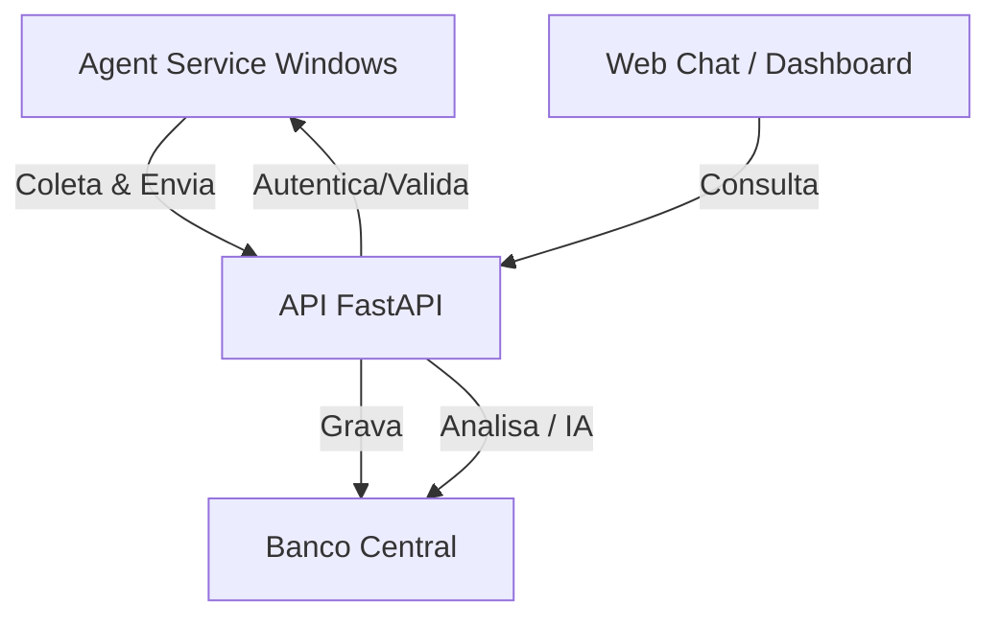

# Arquitetura do projeto SafeBase AI (Atualizada)

## Objetivo

Criar um sistema distribuído para análise inteligente dos dados coletados pelo SafeBase, com autenticação forte, controle por categorias e interface web no estilo chat/DeepSeek. O sistema suporta múltiplas instâncias SafeBase e consolida dados em uma API central, permitindo análises por IA e dashboards.

---

## Visão geral do projeto

O projeto possui 4 componentes principais:

1. **Agent Service (Windows Service)**
   - instalado localmente em cada instância SafeBase
   - coleta dados de tabelas locais do SafeBase
   - envia pacotes para a API central

2. **API Central (FastAPI)**
   - recebe dados dos agentes
   - valida e salva no banco central
   - expõe endpoints para leitura, chat, gráficos e IA
   - controla RBAC, categorias e permissões

3. **IA Orquestrador (Python)**
   - gera análises com base nos dados armazenados no banco
   - suporta modos: rápido, especialista, gráfico (visão futuro)

4. **Web Application (Chat/Dashboard)**
   - UI interativa estilo DeepSeek
   - usa JWT e categorias liberadas para acesso

---

## Diagrama de fluxo

---

## Autenticação, RBAC e Categorias

### Autenticação
- JWT como padrão (login) + API Key opcional
- `/auth/login`, `/auth/me`, `/auth/refresh`, `/auth/logout`

### RBAC
- Roles e permissions por usuário
- Exemplo: `admin`, `users.manage`, `categories.manage`

### Categorias de domínio
- Cada usuário possui categorias liberadas (ex.: `dba`, `seguros`, `credito_trabalhador_clt`)
- O chat e o IA só operam dentro das categorias liberadas

---

## Chat + IA

### Chat
- Conversas por usuário
- `pinned`, `temperature`, `max_tokens`
- `rename`, `pin`, `settings`, `delete`
- categoria obrigatória por conversa

### IA
- `/ia/query` suporta `mode`:
  - `rapido`
  - `especialista`
  - `grafico`
- Se `mode=grafico`, retorna estrutura de gráfico

---

## Gráficos

- `/ia/query` com `mode=grafico` retorna payload de gráfico
- Favoritos por usuário: `/charts/favorites`
- Compartilhamento: `/charts/favorites/{id}/share`

---

## Admin

- Gerenciar categorias
- Gerenciar usuários
- Gerenciar fontes externas
- Gerenciar categorias liberadas por usuário

---

## Estrutura de dados (principal)

- **users**
- **roles / permissions / user_roles / role_permissions**
- **chat_conversas** (com categoria_id, pinned, temperature)
- **chat_mensagens**
- **chat_categorias**
- **user_categorias**
- **user_settings**
- **chart_favorites / chart_favorite_shares**
- **external_data_sources**
- **auth_refresh_tokens**

---

## Observação
O módulo IA pode ser separado futuramente, mas no MVP atual permanece integrado à API FastAPI para simplificar deploy.

### Funcionamento em múltiplas instâncias SafeBase
- cada instância instala o agente local
- agente coleta e envia dados periodicamente
- API central consolida dados de todas as instâncias
- IA analisa de forma unificada
- web acessa a visão consolidada

### Serviço local não precisa ser web
- ele é um Windows Service
- pode usar HTTP para enviar ao central
- pode também ter fallback offline/local cache

## Observações de especialista

- manter a IA key no banco central é aceitável, mas somente se estiver corretamente criptografada e com controle de acesso rígido
- a API central é o melhor lugar para descriptografar a chave e chamar o provedor de IA
- o agente local não deve poder ver a chave real nem armazená-la em texto claro
- separar os projetos torna o sistema mais escalável e seguro

## Próximos passos

1. definir o escopo inicial de dados coletados
2. criar o modelo de dados central mínimo
3. desenhar o contrato HTTP do agente para API
4. implementar o MVP do FastAPI
5. construir a UI de chat básica

---

Este documento descreve o projeto completo, a arquitetura e o fluxo, com foco em segurança e escalabilidade para múltiplas instâncias.
